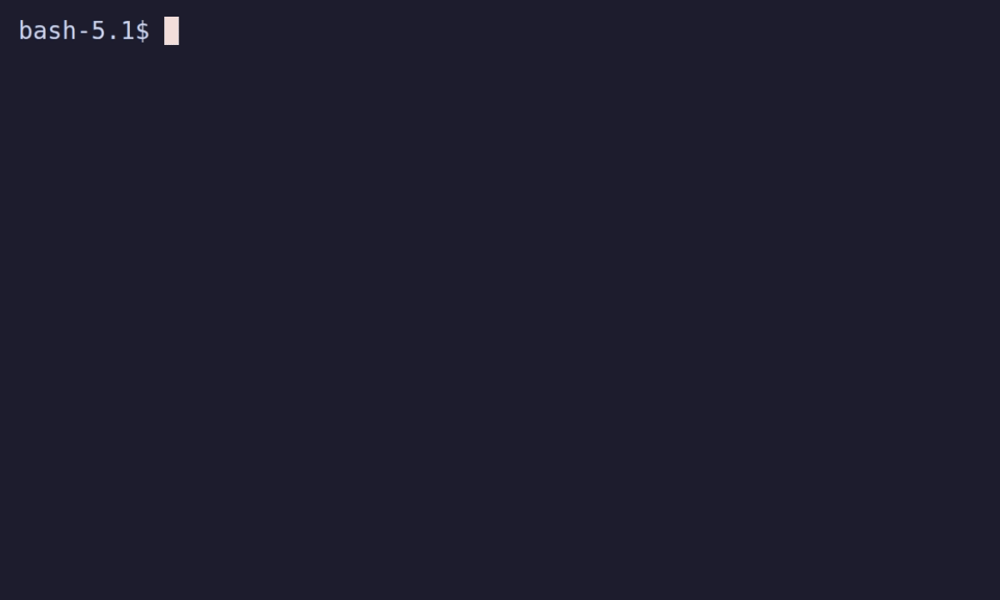

# speckeep

[](https://github.com/bzdvdn/speckeep/actions/workflows/ci.yml)
[](https://github.com/bzdvdn/speckeep/releases)
[](LICENSE)
[](go.mod)
[](https://goreportcard.com/report/github.com/bzdvdn/speckeep)
[](https://bzdvdn.github.io/speckeep/)

**Strict, lightweight spec-driven development for coding agents.** `speckeep` keeps specs, plans, tasks, and traceability in plain files so agents and people stay aligned — without heavy process.

English · [Русский](README.ru.md) · [Docs](https://bzdvdn.github.io/speckeep/) · [Roadmap](docs/en/roadmap.md) · [Releases](https://github.com/bzdvdn/speckeep/releases)

SpecKeep is the successor to DraftSpec (archived). Migrate with `speckeep migrate`.



---

## Contents

- [Quick Start](#quick-start--30-seconds)
- [Why speckeep?](#why-speckeep)
- [Workflow](#workflow)
- [Positioning](#positioning)
- [CLI](#cli)
- [CI](#ci)
- [Install](#install)
- [Example Feature Cycle](#example-feature-cycle)
- [Documentation](#documentation)
- [Development](#development)
- [License](#license)

---

## Quick Start — 30 seconds

```bash
# 0. Install (or use npx speckeep ... without installing)
curl -fsSL "https://raw.githubusercontent.com/bzdvdn/speckeep/main/scripts/install.sh" | bash

# 1. Try it instantly — no project setup needed
speckeep demo ./my-demo

# 2. See what was created
speckeep dashboard ./my-demo

# 3. Init a real project
speckeep init my-project --lang en --shell sh --agents claude
```

That's it. You now have a project with constitution, spec, plan, tasks, inspect report, and data model — plus agent prompt files and `AGENTS.md`.

---

## Why speckeep?

Teams using AI coding agents face a common problem: agents lose context between sessions, drift from requirements, and produce untestable code.

speckeep solves this with **discipline per token** — minimal file-based structure that keeps agents and humans on the same page:

- **Specs** with stable IDs (`AC-*`, `RQ-*`) — agents know exactly what to build and verify
- **Tasks** with surface maps and phase grouping — agents execute in order, one phase at a time
- **Traceability** (`Proof:` entries in `tasks.md`) — prove that every requirement is implemented and tested
- **19 agent adapters** — Claude Code, Codex, Cursor, Copilot, OpenCode, aider, Amazon Q, Gemini, Jules, Cline, Devin, Goose, Refact, Windsurf, and more ([maintenance tiers](docs/en/agents.md#maintenance-tiers)) — Continue.dev support was dropped after reports the product was discontinued
- **Fast closing loop** (`/spk-converge`) — turn implementation gaps into follow-up tasks and iterate until converged
- **CI gate** (`speckeep guard`) — machine-verifiable "is every feature closeable now?"
- **Express lane** — tiny/low-risk features skip `plan.md`/`data-model.md` and close from `spec.md` + `tasks.md`
- **One-shot propose** (`/spk-propose`) — idea → `spec.md` + `tasks.md` in a single pass, straight to implement
- **Drop-in migration** (`speckeep import openspec|speckit`) — convert OpenSpec/Spec Kit feature packages into speckeep layout in seconds
- **Compact archive** (`--compact`) — keep only `summary.md` + git pointer instead of copying every artifact

Results in practice: agents produce correct code on first try more often, handoffs between sessions cost less context, and requirements stay reviewable by humans.

---

## Workflow

```
constitution → spec → [inspect] → plan → tasks → implement → archive
```
`verify` is an optional on-demand audit; archive is allowed once every `[x]` task carries a `Proof:` entry (or after `verify: pass`).

Each phase loads only the minimum context. Optional workflow commands available at any phase: `/spk-challenge`, `/spk-handoff`, `/spk-hotfix`, `/spk-scope`, `/spk-recap`.

---

## Positioning

| Dimension         | speckeep                           | OpenSpec               | Spec Kit                   |
| ----------------- | ---------------------------------- | ---------------------- | -------------------------- |
| Workflow style    | Strict phase chain, narrow context | Fluid artifact-guided  | Thorough multi-step SDD    |
| Default context   | Smallest                           | Moderate               | Largest                    |
| Artifact overhead | Low                                | Medium                 | High                       |
| Brownfield        | High                               | High                   | Medium                     |
| Collaboration     | Branch-first, feature-local        | Change-folder oriented | Branch-heavy               |
| Best fit          | Lean strict SDD on real codebases  | Flexible SDD-lite      | Full-featured rigorous SDD |

---

## CLI

```text
speckeep init [path]
speckeep refresh [path]
speckeep doctor [path] [--json]
speckeep dashboard [path]
speckeep check <slug> [path] [--json]
speckeep check [path] --all [--json]
speckeep feature <slug> [path]
speckeep features [path]
speckeep list-specs [path]
speckeep show-spec <name> [path]
speckeep trace <slug> [path]
speckeep export <slug> [path] [--output <file>]
speckeep converge <slug> [path] [--json]
speckeep guard [path] [--slug <slug>] [--json]
speckeep import <openspec|speckit> [path] [--json]
speckeep demo [path]
speckeep archive <slug> [path] [--compact]
speckeep list-archive [path] [--status <status>] [--since <YYYY-MM-DD>] [--json]
speckeep self check | self upgrade
speckeep migrate [path]
speckeep add-agent | list-agents | remove-agent | cleanup-agents [path]
```

Agent support is **skills-first**: `speckeep init --agents opencode,claude` lays a composite SpecKeep `sdd` skill pack (a root `SKILL.md` plus one self-contained per-phase skill file, each inlining its full phase instructions) into each target's standard skills directory (`.opencode/skills/`, `.claude/skills/`, …). The CLI stays the deterministic spine that skills call as gates (`check`, `converge`, `guard`).

---

## CI

Use the bundled GitHub Action to keep every pull request green against the SpecKeep gate:

```yaml
- uses: bzdvdn/speckeep/.github/actions/speckeep@main
  with:
    root: .
```

It installs speckeep, detects changed `specs/active/<slug>/` features, and runs `speckeep guard` on each (fails the PR when a touched feature is not closeable). A copy-paste ready workflow lives in [`contrib/ci/speckeep-guard.yml`](contrib/ci/speckeep-guard.yml).

---

## Install

**Linux / macOS:**

```bash
curl -fsSL "https://raw.githubusercontent.com/bzdvdn/speckeep/main/scripts/install.sh" | bash
# add --version v1.0.1 to pin; --add-to-path to register PATH
```

**Windows (PowerShell):**

```powershell
powershell -ExecutionPolicy Bypass -c "iwr -useb https://raw.githubusercontent.com/bzdvdn/speckeep/main/scripts/install.ps1 | iex"
```

The binary is automatically added to PATH on Windows. On Linux, use `--add-to-path` if the install directory is not already on your PATH.

**Package managers:**

- Homebrew: `brew install bzdvdn/speckeep/speckeep` (see `contrib/packaging/brew/`)
- Scoop: `scoop bucket add speckeep https://github.com/bzdvdn/scoop-speckeep && scoop install speckeep` (see `contrib/packaging/scoop/`)
- npm: `npx speckeep init` or `npm install -g speckeep` — a thin launcher that downloads the matching native binary on install (see `contrib/packaging/npm/`)
- Go: `go install speckeep@latest`

**Update the installed binary:**

```bash
speckeep self check     # current vs latest release (read-only)
speckeep self upgrade   # download, sha256-verify, and replace in place
```

**Build from source:**

```bash
go build -ldflags "-X speckeep/src/internal/cli.Version=v1.0.1" -o bin/speckeep ./src/cmd/speckeep
```

---

## Example Feature Cycle

<details>
<summary>Full workflow: "Add CSV export to reports" →</summary>

### 1. Init

```bash
speckeep init . --lang en --shell sh --agents claude
```

### 2. Spec

Call `/spk-spec --name "CSV export for reports"` in your agent.

`specs/active/csv-export-for-reports/spec.md`:

```markdown
## Goal

Allow users to download the reports table as a CSV file.

## Acceptance Criteria

**AC-001** Export produces a file
Given the Reports page has at least one row
When the user clicks "Export CSV"
Then a .csv file downloads with column headers and all visible rows

**AC-002** Empty state is handled
Given the reports table is empty
When the user clicks "Export CSV"
Then a .csv with headers only downloads — no error shown
```

### 3. Inspect

Call `/spk-inspect csv-export-for-reports`. Produces `inspect.md` with verdict.

### 4. Plan

Call `/spk-plan csv-export-for-reports`. Surfaces: `ReportsPage.tsx`, `useReportExport.ts`, `reports.test.ts`.

### 5. Tasks

Call `/spk-tasks csv-export-for-reports`. Produces `tasks.md`:

| Surface                    | Tasks |
| -------------------------- | ----- |
| hooks/useReportExport.ts   | T1.1  |
| components/ReportsPage.tsx | T1.2  |
| tests/reports.test.ts      | T2.1  |

### 6. Implement, verify, archive

```
/spk-implement csv-export-for-reports
/spk-verify    csv-export-for-reports   # verdict: pass
speckeep archive    csv-export-for-reports .
```

### Check readiness at any point

```bash
speckeep check csv-export-for-reports
# Phase:  tasks → implement
# Tasks:  0 / 3 done
# Next:   /spk-implement csv-export-for-reports
```

</details>

---

## Key Concepts

### Artifacts

Each feature lives under `specs/<slug>/` with:

- `spec.md` — requirements (`RQ-*`) and acceptance criteria (`AC-*` with Given/When/Then)
- `inspect.md` (optional) — quality gate before planning
- `plan.md` — design decisions (`DEC-*`) and incremental delivery
- `tasks.md` — executable tasks with surface map and phase grouping
- `data-model.md` — entities, fields, invariants
- `contracts/api.md`, `contracts/events.md` (optional)
- `verify.md` — verification evidence

### Traceability

During implementation, record evidence for each completed task as a `Proof:` line directly below the `[x]` checkbox in `tasks.md`:

```
- [x] T1.1 Add export handler
  Proof: code src/handlers/export.go ExportHandler
  Proof: test src/tests/export_test.go TestExportFlow
```

`Proof: <kind> <path> [<anchor>]`, where `kind` is `code|test|docs|chore`. A checked task without a `Proof:` entry is not done — `speckeep check` and `speckeep archive` block it. Evidence is read only from `tasks.md`; there are no trace markers in source code.

Verify with:

```bash
speckeep trace <slug> .
```

### Agent adapters (skills-first)

Supported out of the box: `claude`, `codex`, `copilot`, `cursor`, `kilocode`, `opencode`, `trae`, `windsurf`, `roocode`, `aider`, `amazonq`, `gemini`, `jules`, `cline`, `devin`, `goose`, `refact`, `codiumate`, `qwen-code`.

```bash
speckeep init my-project --agents opencode,claude    # lays the sdd skill pack
```

The skills live under the target's skills directory: a lightweight `sdd` overview skill plus one independent, directly slash-invocable skill per phase:

```text
.<target>/skills/
  sdd/
    SKILL.md          # overview: workflow chain, gates — reach for this when the phase isn't obvious
  spk-spec/
    SKILL.md           # each phase is its own top-level skill: /spk-spec, /spk-plan, /spk-implement, ...
  spk-plan/
    SKILL.md
  ...
```

Each phase skill is its own directory (not nested resource files) so it is directly slash-invocable — e.g. typing `/spk-spec` in Claude Code — instead of only reachable through the model deciding to open a linked file. Each one inlines the canonical prompt from `.speckeep/templates/prompts/` (kept in sync automatically) so an agent gets the full phase instructions from one file, and is gated by `speckeep check`; closing uses `speckeep converge` / `speckeep guard`. `aider` additionally gets a `.aider/CONVENTIONS.md` pointer because it has no skill loader.

---

## Documentation

Extended docs in [`docs/`](docs/README.md):

- [Overview](docs/en/overview.md)
- [CLI Reference](docs/en/cli.md)
- [Workflow Model](docs/en/workflow.md)
- [Architecture](docs/en/architecture.md)
- [Agents](docs/en/agents.md)
- [Examples](docs/en/examples.md)
- [FAQ](docs/en/faq.md)
- [Glossary](docs/en/glossary.md)
- [Roadmap](docs/en/roadmap.md)

Project:

- [Contributing](CONTRIBUTING.md)
- [Code of Conduct](CODE_OF_CONDUCT.md)
- [Security Policy](SECURITY.md)
- [MVP Definition](MVP.md)
- [Changelog](CHANGELOG.md)

## Demo

A reproducible terminal demo is available under [`demo/`](demo/README.md):

```bash
go build -o bin/speckeep ./src/cmd/speckeep
vhs demo/quick.tape
```

## Development

Requires **Go 1.26+**.

```bash
go test ./...
go vet ./...
go build -o bin/speckeep ./src/cmd/speckeep
```

## License

Released under the [MIT License](LICENSE).
